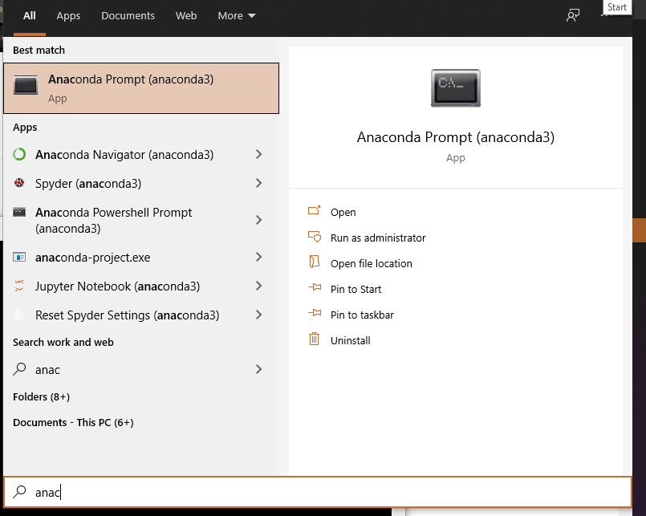
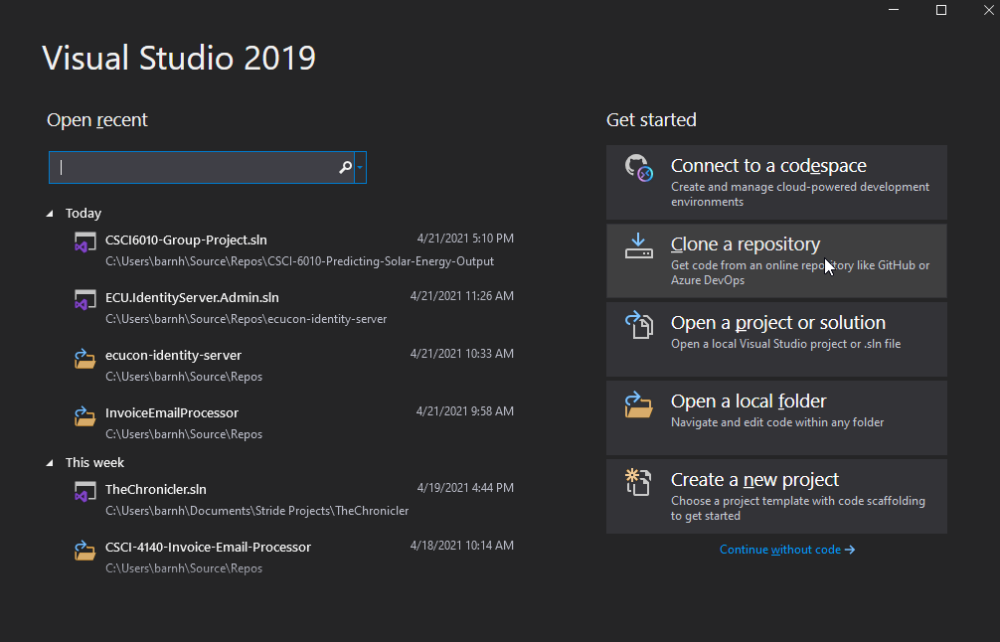
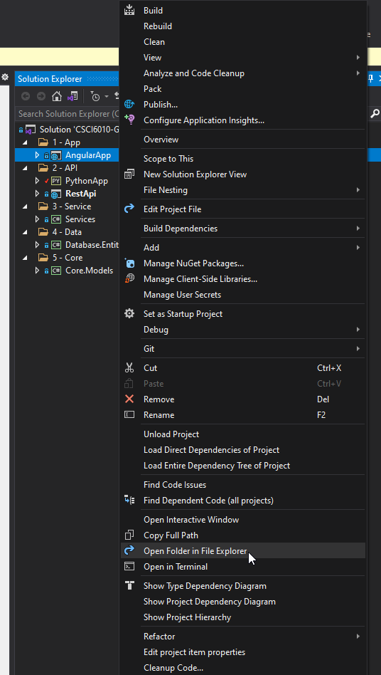
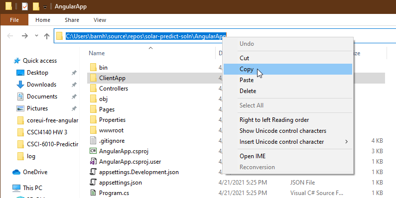
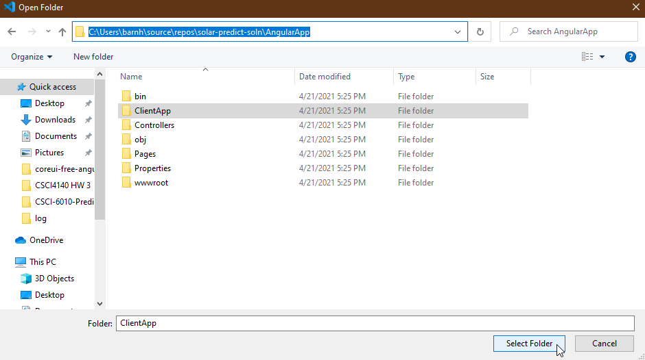

# Welcome

This is the repository for the ECU Spring 2021 CSCI 6010 Solar Energy Prediction Project.

Please read the step-by-step instructions below to get up and running with the applications.

## Table of Contents

- [Welcome](#welcome)
  - [Table of Contents](#table-of-contents)
- [Required Installations](#required-installations)
- [Creating the Anaconda Environment](#creating-the-anaconda-environment)
- [Cloning The Repository](#cloning-the-repository)
- [Assigning the Anaconda Environment in Visual Studio](#assigning-the-anaconda-environment-in-visual-studio)
    - [Install AngularApp Dependencies](#install-angularapp-dependencies)
- [Running the Projects Locally](#running-the-projects-locally)

# Required Installations

Please install the following SDKs and other software:

- .NET Core 3.1 SDK - https://dotnet.microsoft.com/download
- Visual Studio Community 2019 - https://visualstudio.microsoft.com/vs/community/
- Visual Studio Code - https://code.visualstudio.com/download
- GIT - https://git-scm.com/downloads
- NodeJS (LTS or Current, doesn't matter)- https://nodejs.org/en/
- Python - https://www.python.org/downloads/
- Anaconda - https://www.anaconda.com/products/individual

# Creating the Anaconda Environment

An Anaconda environment is the best way to install the fbProphet packages that our Python API is dependent on. To create the necessary environment:

1. Find where Anaconda installed the `Anaconda Prompt` and open it. On Windows 10 you can open the Start menu and search for it:

   

2. Run the command `conda create -n solar-predict` to create an Anaconda environment named solar-predict. It should prompt in response with a Package Plan, approve this:

   

3. Run the command `conda activate solar-predict` to activate the environment:

   

4. Run the command `conda install -c conda-forge fbprophet` to install the fbProphet package, it will output a list of other packages it is dependent on and ask confirmation for installing those as well. Confirm to install everything:
   

   It should install fbProphet and all of its dependencies:
   

5. Repeat the `conda install` command for the following packages:
   - flask
     - `conda install -c anaconda flask`
   - flask-cors
     - `conda install -c anaconda flask-cors`
   - geopy
     - `conda install -c conda-forge geopy`
   - numpy
     - `conda install -c anaconda numpy`
   - pandas
     - `conda install -c anaconda pandas`
   - matplotlib
     - `conda install -c conda-forge matplotlib`
   - IPython
     - `conda install -c anaconda ipython`

You should have all of the python dependencies installed. Next you'll need to clone the repo.

#

#

# Cloning The Repository

1. Open `Visual Studio Community 2019` and click the `Clone Repository` button:

   

2. In the next window, paste `https://newhat.visualstudio.com/CSCI-6010-Predicting-Solar-Energy-Output/_git/CSCI-6010-Predicting-Solar-Energy-Output` into the `Repository location` input field:

   

3. Remove the hyphens from the Path (or enter a new path of your choosing)then click the Create button. Visual Studio should then open showing the Solution Explorer with the cloned files on the right side of the window:

   

You now have cloned all of the code artifacts of our project. Next we need to assign the PythonAPI Visual Studio project the Anaconda Environment we created earlier.

If you ran into issues while cloning, make sure that you have installed git and have been granted access to the repo. Please contact barnhouset09@gmail.com requesting for access.
If git wasn't installed, make sure to have restarted your computer after installation.

#

#

# Assigning the Anaconda Environment in Visual Studio

To assign the Anaconda environment we created,

1. Go to the `Solution Explorer` and right-click on the PythonAPI Visual Studio project. Click the `Properties` option:

   

2. Set the `Interpreter` option to the `solar-predict`, this was created by anaconda when we ran the `conda create -n solar-predict` command in the Anaconda Prompt earlier. Your Properties tab in Visual Studio should look liked this:

   

3. Make sure to Save by either pressing `CTRL + S` or by clicking the `Save` button in Visual Studio:

   

Now the PythonApp Flask Web API project should be able to successfully reference the Python packages and execute correctly. 

Next we need to get the Angular front-end project's dependencies set up.

#

#

# Install AngularApp Dependencies

To install the AngularApp npm dependencies, we need to open the angular clientApp code folder in `Visual Studio Code` (NOT Visual Studio Community). To do this quickly:

1. In `Visual Studio Community`, go to your `Solution Explorer`, right-click the AngularApp project, and click the `Open Folder in File Explorer` option:

   

2. A Windows File Explorer window will open. Copy the address from the address bar:

   

3. Next we need to open `Visual Studio Code` (NOT Visual Studio Community!). Once open, click `File > Open Folder`:

   

4. Paste the address we copied from the previous steps:

   

5. Select the ClientApp folder and then click the `Select Folder` button, as seen above.

6. Next you should see all of the contents of the angular project in the Explorer pane of `Visual Studio Code`:

   

7. Now we need to open the `Powershell Command Prompt`, do this by pressing the `` CTRL + `  `` keys or by clicking `Terminal > New Terminal`:

   

8. This will open a new window at the bottom of `Visual Studio Code` that looks like this:

   

9. Enter the following command to install the angular dependencies:
   `npm install`

   

This should install all of the required dependencies. If you run into issues, make sure that you've installed Node. You may need to restart `Visual Studio Code` after installation.

# Running the Projects Locally

Now that all of the dependencies for the angular application and the python project are in place, let's run the Angular website and Python API locally. To do this,

1. In `Visual Studio Community` (NOT Visual Studio Code!) go to the `Solution Explorer`, right-click the Solution and select `Set Starup Project...`:

   

2. Once the window opens, select the `Multiple startup projects` and set the AngularApp and PythonApp Action settings to Start, then click Apply and then OK:

   

3. Now click the Start button in `Visual Studio Community` to begin debugging the project locally.

   

   Both a browser window and a console application should open. Enjoy!
