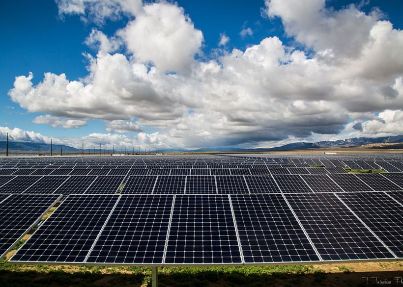
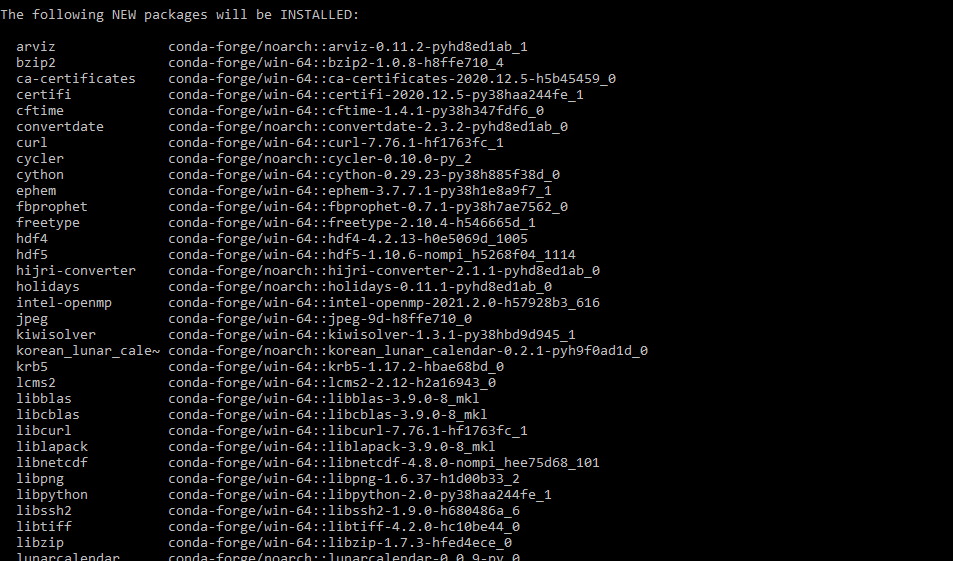
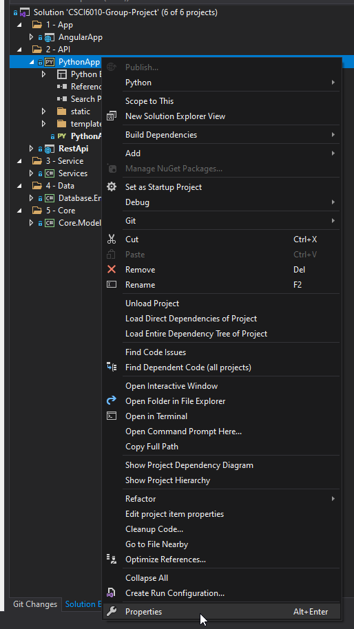
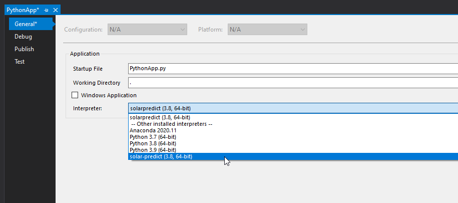
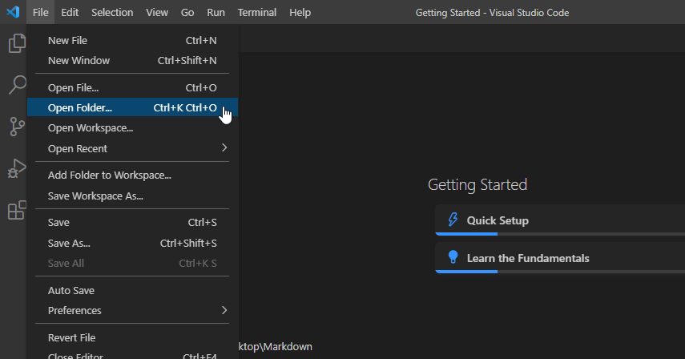
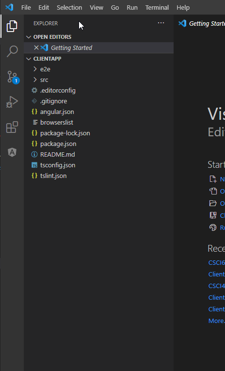
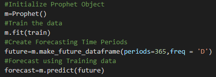
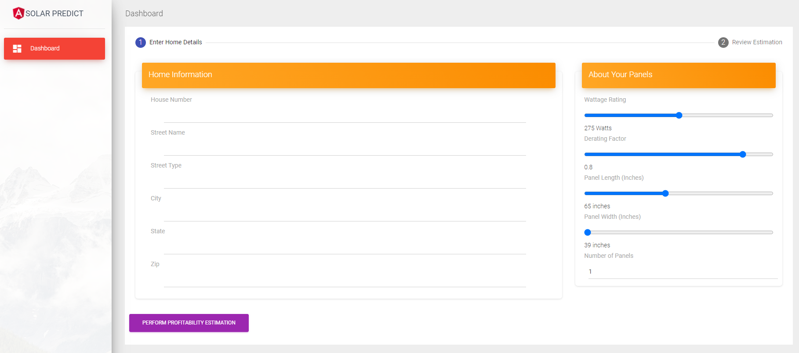
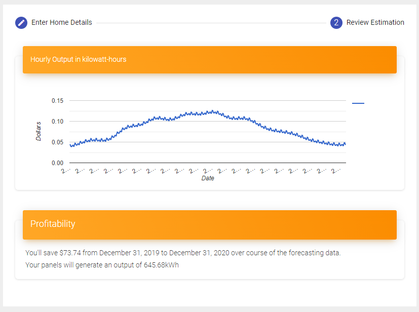

# Welcome

This is the repository for the Solar Energy Prediction Project.

      

   [Report summary](https://drive.google.com/file/d/1hUFpejIHVp32mQwq2wlmPpdV5d3DPyO_/view?usp=sharing) 
   [Presentation link ](https://drive.google.com/file/d/1DKhm8nWHldb4MFDzc3mclUluIGyNRgSm/view?usp=sharing)  

# Abstract

For this project we have built a web platform that allows interested parties to predict the amount of solar energy that can be collected at a given residential address. It consists of a website and a REST API, where the website provides a form for the user-entered address data which is then sent to the REST API to formulate solar prediction data. Our predictions utilize a powerful time-series forecasting library from Facebook called **Prophet**, and the predictions it makes are based on Global Horizontal Irradiance (GHI) data collected by the US National Renewable Energy Laboratory (NREL) in the publicly available National Solar Radiation Database (NSRDB). After users have supplied their residence information, they are provided an informative dashboard that forecasts their predicted hourly solar energy generation once the prediction is completed. This dashboard also provides costsavings information over the course of the next year starting from the time the user submits their address.

Please read the step-by-step instructions below to get up and running with the applications.

## Table of Contents

- [Welcome](#welcome)
  - [Table of Contents](#table-of-contents)
- [Required Installations](#required-installations)
- [Creating the Anaconda Environment](#creating-the-anaconda-environment)
- [Cloning The Repository](#cloning-the-repository)
- [Assigning the Anaconda Environment in Visual Studio](#assigning-the-anaconda-environment-in-visual-studio)
    - [Install AngularApp Dependencies](#install-angularapp-dependencies)
- [Running the Projects Locally](#running-the-projects-locally)
- [Method](#method)
   - [Forecasting GHI Using Prophet](#forecasting-ghi-using-prophet)
   - [Modeling using Hourly Data](#modeling_using_hourly_data)
- [Results](#results)
   - [SolarPredict User Interface](#solarpredict-user-interface)

# Required Installations

Please install the following SDKs and other software:

- .NET Core 3.1 SDK - https://dotnet.microsoft.com/download
- Visual Studio Community 2019 - https://visualstudio.microsoft.com/vs/community/
- Visual Studio Code - https://code.visualstudio.com/download
- GIT - https://git-scm.com/downloads
- NodeJS (LTS or Current, doesn't matter)- https://nodejs.org/en/
- Python - https://www.python.org/downloads/
- Anaconda - https://www.anaconda.com/products/individual

# Creating the Anaconda Environment

An Anaconda environment is the best way to install the fbProphet packages that our Python API is dependent on. To create the necessary environment:

1. Find where Anaconda installed the `Anaconda Prompt` and open it. On Windows 10 you can open the Start menu and search for it:

   

2. Run the command `conda create -n solar-predict` to create an Anaconda environment named solar-predict. It should prompt in response with a Package Plan, approve this:

   

3. Run the command `conda activate solar-predict` to activate the environment:

   

4. Run the command `conda install -c conda-forge fbprophet` to install the fbProphet package, it will output a list of other packages it is dependent on and ask confirmation for installing those as well. Confirm to install everything:
   

   It should install fbProphet and all of its dependencies:
   

5. Repeat the `conda install` command for the following packages:
   - flask
     - `conda install -c anaconda flask`
   - flask-cors
     - `conda install -c anaconda flask-cors`
   - geopy
     - `conda install -c conda-forge geopy`
   - numpy
     - `conda install -c anaconda numpy`
   - pandas
     - `conda install -c anaconda pandas`
   - matplotlib
     - `conda install -c conda-forge matplotlib`
   - IPython
     - `conda install -c anaconda ipython`

You should have all of the python dependencies installed. Next you'll need to clone the repo.

 

# Cloning The Repository

1. Open `Visual Studio Community 2019` and click the `Clone Repository` button:

   

2. In the next window, paste `https://newhat.visualstudio.com/CSCI-6010-Predicting-Solar-Energy-Output/_git/CSCI-6010-Predicting-Solar-Energy-Output` into the `Repository location` input field:

   

3. Remove the hyphens from the Path (or enter a new path of your choosing)then click the Create button. Visual Studio should then open showing the Solution Explorer with the cloned files on the right side of the window:

   

You now have cloned all of the code artifacts of our project. Next we need to assign the PythonAPI Visual Studio project the Anaconda Environment we created earlier.

If you ran into issues while cloning, make sure that you have installed git and have been granted access to the repo. Please contact barnhouset09@gmail.com requesting for access.
If git wasn't installed, make sure to have restarted your computer after installation.

 

# Assigning the Anaconda Environment in Visual Studio

To assign the Anaconda environment we created,

1. Go to the `Solution Explorer` and right-click on the PythonAPI Visual Studio project. Click the `Properties` option:

   

2. Set the `Interpreter` option to the `solar-predict`, this was created by anaconda when we ran the `conda create -n solar-predict` command in the Anaconda Prompt earlier. Your Properties tab in Visual Studio should look liked this:

   

3. Make sure to Save by either pressing `CTRL + S` or by clicking the `Save` button in Visual Studio:

   

Now the PythonApp Flask Web API project should be able to successfully reference the Python packages and execute correctly. 

Next we need to get the Angular front-end project's dependencies set up.

 

# Install AngularApp Dependencies

To install the AngularApp npm dependencies, we need to open the angular clientApp code folder in `Visual Studio Code` (NOT Visual Studio Community). To do this quickly:

1. In `Visual Studio Community`, go to your `Solution Explorer`, right-click the AngularApp project, and click the `Open Folder in File Explorer` option:

   

2. A Windows File Explorer window will open. Copy the address from the address bar:

   

3. Next we need to open `Visual Studio Code` (NOT Visual Studio Community!). Once open, click `File > Open Folder`:

   

4. Paste the address we copied from the previous steps:

   

5. Select the ClientApp folder and then click the `Select Folder` button, as seen above.

6. Next you should see all of the contents of the angular project in the Explorer pane of `Visual Studio Code`:

   

7. Now we need to open the `Powershell Command Prompt`, do this by pressing the `` CTRL + `  `` keys or by clicking `Terminal > New Terminal`:

   

8. This will open a new window at the bottom of `Visual Studio Code` that looks like this:

   

9. Enter the following command to install the angular dependencies:
   `npm install`

   

This should install all of the required dependencies. If you run into issues, make sure that you've installed Node. You may need to restart `Visual Studio Code` after installation.

# Running the Projects Locally

Now that all of the dependencies for the angular application and the python project are in place, let's run the Angular website and Python API locally. To do this,

1. In `Visual Studio Community` (NOT Visual Studio Code!) go to the `Solution Explorer`, right-click the Solution and select `Set Starup Project...`:

   

2. Once the window opens, select the `Multiple startup projects` and set the AngularApp and PythonApp Action settings to Start, then click Apply and then OK:

   

3. Now click the Start button in `Visual Studio Community` to begin debugging the project locally.

   

   Both a browser window and a console application should open. Enjoy!

# Method
Since GHI is stored in a Time series dataset, we will be using Time Series Analysis to ex-tract meaningful characteristics of data and generate other useful insights. The basic objective of time series analysis is to determine a model that describes the pattern of the time series that could be used for forecasting future GHI values for a particular location.

# Forecasting GHI Using Prophet
We will be using GHI daily data from 2016 to 2018 in order to train our model and the
2019 GHI data to test our model. The data returned by NSRDB had hourly data so in order to use daily data, we calculate the Average GHI values and grouped them by day. The code snippet in Figure 1 shows how easy it is to initialize, train and forecast the
data. 

   

#### Figure 1 - This code snippet shows how easy it was to initialize, fit the data and make future predictions using Prophet.

 

Prophet also provides a convenient method to quickly plot the results of our forecasts. In figure 2, Prophet plots a single graph containing a scatter plot of historical data points indicated by black dots and the forecast/fitted curve indicated by a blue line. The graph also contains a light blue shaded region which cor-
responds to the uncertainty bands.

   

#### Figure 2 - Forecasting 2019 data using Prophet. Black dots are the observed data from 2016 to 2019. Blue line in the graph indicates the forecast/fitted curve and the light blue shaded region corresponds to the uncertainty bands. As you see here Prophet was able to train and predict the overall trend.

 

# Modeling using Hourly Data

After modeling the forecasting using daily data we realized that for energy calculations, its more appropriate to have hourly predictions in order to better calculate profitability. As you see in Figure 3, we used an similar approach to modeling the hourly data as we did with the daily data. Models 1 and 4 indicated by the yellow and red graphs respectively and they seem to overfit the Observed data. Model 2 indicated by the blue graph and has a better over all fit but still does not account for the sudden changes. Model 3 indicated by the green graph seems to have better fit and accounts for sudden changes in some of the months in respect to the observed data.

Thus, we will be using Model 3 going forward in our forecasting and energy profitability calculations.

   

#### Figure 3 - Data Modeling the GHI Daily Values using Prophet - Prophet provides tunable parameters to better fit the training data to test data. This figure depicts how with each model we were able to get closer to the test data.

 

# Results
Our final product included a user interface built on Angular that interacted with a
Python Flask API to query for location-based irradiance data from the NSRDB. The user
interface took in the user’s home address and details about solar paneling he or she
is considering for purchase. After retrieving the relevant irradiance data, we were able to closely forecast the solar energy available at a particular location using the Prophet forecasting tool.

This was done by fitting the dataset on the Prophet model once we had retrieved it.
We then used this model to predict future data as you can see in figure 15. The output
from Prophet is a Panda’s Dataframe which has the ˆy or the forecasted GHI Hourly values.

 

# SolarPredict User Interface

The front-end of our website is powered by Angular, a powerful technology for building
cross platform web applications. With it we have access to many chart libraries, including google charts, chart.js and chartist. These libraries are necessary for displaying data clearly. Over the course of the project we were able to create impressive mocked charts from all of the libraries, but ended up utilizing only google charts as it worked better with the way our web page is rendered in a browser.

Our website uses a layout provided by Creative Tim, who offers a number of  lite-versions of his own dashboard templates for displaying aggregated data. It is powered by the chart libraries we’ve mentioned previously, as well as bootstrap and angular material libraries for rapid development of device-agnostic web user interfaces. This layout will aid us in building a UI faster without having to put too
much concern on how it looks, as the styling of the page’s components is already done for us.

Our project requires input of the geolocation of where we want to measure solar energy generation potential. It also requires additional information about the solar panels the user is looking to install on their home. Figure 4 shows an example of what this portion of UI in our project looks like.

   

#### Figure 4 - The web application as presented to the user upon first visiting the web page. It consists of a form where users can enter their address and panel information. 

After the user has entered their address data, they are presented with a page with
a graph showing their hourly solar energy generation, and some additional information
about total energy generated and the average energy cost-savings the user should expect
over a given year (see Figure 5).

   

#### Figure 5 - The results page displaying cost analysis over time